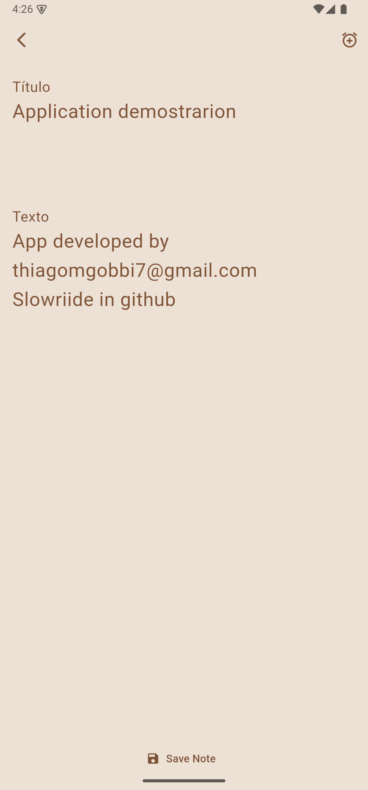
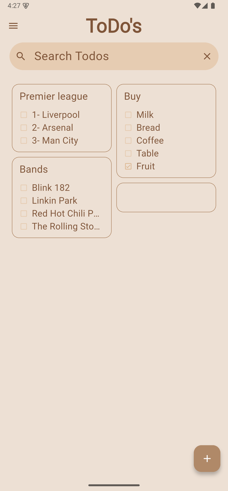
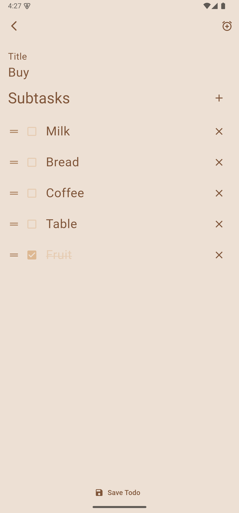

# ToDo App

A Flutter application for managing notes and todos with reminders, subtasks, and notifications.

---

## Features

- **Notes and Todos Management:** Create, edit, delete notes and todos.
- **Subtasks:** Add, reorder, complete, and delete subtasks within todos.
- **Reminders:** Set date and time reminders for notes and todos.
- **Notifications:** Scheduled notifications for reminders.
- **Local Storage:** Data persistence using Isar database.
- **Theming:** Supports light and dark modes with dynamic theme switching.
- **Search:** Search functionality for notes and todos.
- **User Interface:** Clean, responsive UI with custom widgets and material design.

---

## Screenshots

### 📝 Notes View
![Notes List]
(assets/screenshots/todos_view.png)
(assets/screenshots/notes_view_selection.png)

### ➕ Add Note / ✏️ Edit Note


### ✅ To-Do List


### ➕ Add Todo / ✏️ Edit Todo


### ⏰ Active Reminder
![Active Reminder]
(assets/screenshots/reminder.png)
(assets/screenshots/reminder_2.png)

### 🌙 Dark Mode (optional)
![Dark Mode]
(assets/screenshots/dark_mode.png) 
(assets/screenshots/dark_mode_selection.png)

### 📂 Navigation Drawer
![Navigation Drawer]
(assets/screenshots/drawer.png)

---


### Prerequisites

- Flutter SDK (tested on Flutter 3.x+)
- Dart SDK
- Android Studio / Xcode (for emulator or physical device)

---

## 📦 Installation

1. Clona el repositorio:

   ```bash
   git clone https://github.com/Slowriide/to_do_app.git
   cd to_do_app
   flutter pub get
   flutter run

---

## 📁 Project Structure

lib/
├── main.dart              # App entry point and dependency injection.
├── common/                # Shared utilities and widgets.
├── core/                  # Core services like notifications, theme, local storage, router.
├── data/                  # Data models and repository implementations using Isar database.
├── domain/                # Business models and repository interfaces.
├── presentation/          # UI pages, widgets, and state management (cubits).

---

## State Management

Uses Flutter Bloc package for state management:

NoteCubit — Handles note CRUD operations.
TodoCubit — Handles todo CRUD operations.
ThemeCubit — Manages app theme state.
NoteSearchCubit & TodoSearchCubit — Manage searching/filtering functionality.

---

## Local Storage

Uses Isar database for storing notes and todos.

Data persisted locally on the device.

## Contact
Created by [Thiago Gobbi] - feel free to contact me at [thiagogobbi7@gmail.com]